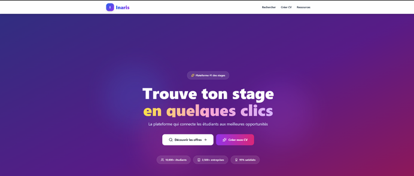
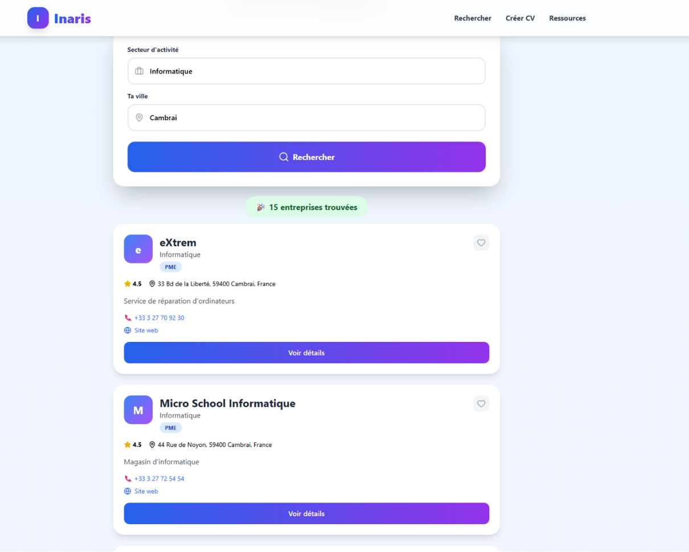
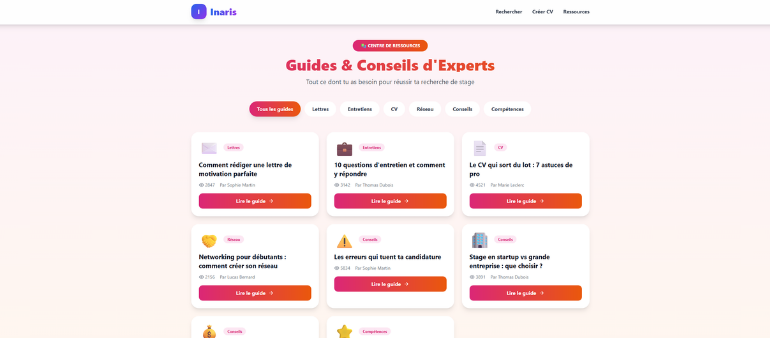

# 🚀 **Inaris** — Plateforme de Recherche de Stages

**Projet** – Baccalauréat Professionnel **CIEL**  
(**Cybersécurité, Informatique et réseaux, Électronique**)

---

## Présentation

Inaris était une application web destinée aux étudiants.  
Elle permettait de **rechercher des entreprises pour un stage** grâce à une **recherche géolocalisée en temps réel** avec l'api [SerpAPI](https://serpapi.com/)

L’objectif était de faciliter la **recherche de stage** en affichant les entreprises proches de l’utilisateur.

---

## Travail réalisé

- Développement frontend (React + Tailwind)
- Développement backend (Node.js / Express)
- Intégration d’une **API** de recherche d’entreprises
- Mise en place de l’architecture __**Docker + Nginx**__
- **Travail approfondi sur la sécurité Linux** :
  - Durcissement **SSH**
  - Configuration **Fail2ban**
  - Pare-feu **UFW**
  - Headers de sécurité **Nginx***
  - Conteneurs **Docker** sécurisés (**read-only**, **no-new-privileges**…)

---

## Captures d’écran

| Accueil | Recherche géolocalisée | Fiche entreprise |
|---------|------------------------|------------------|
|  |  |  |

---

## Remerciements

Merci à **[@mathmart](https://github.com/mathmart-AI)** pour son aide sur le projet.

---

## Auteur

Projet réalisé dans le cadre de mon **Bac Pro Cybersécurité, Informatique et réseaux, Électronique**.
